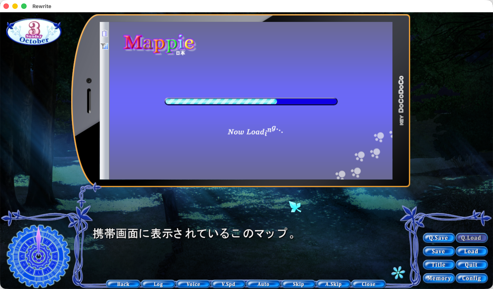
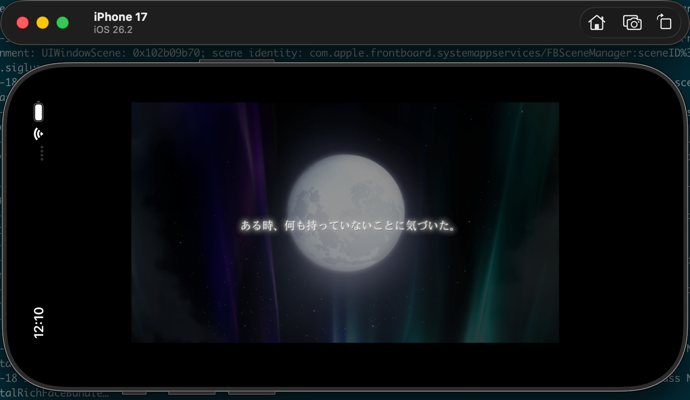
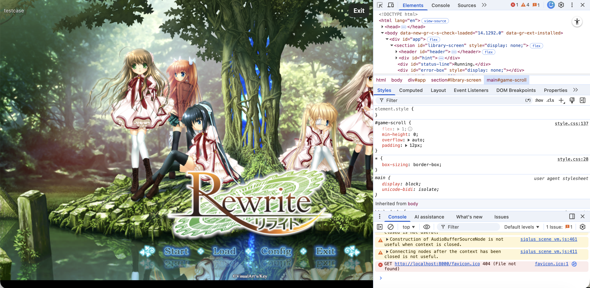

# siglus_rs


**siglus_rs** is an unofficial Rust implementation and multi-platform port of SiglusEngine.

This project is non-commercial and intended for research purposes.

<br clear="left"/>

## Example screenshots
* siglus_rs on macOS


* siglus_rs on iOS


* siglus_rs on WebAssembly


* siglus_rs works on a wide range of platforms, including Windows, Linux, macOS, iOS, Android, and WebAssembly.

| Platform | Targets |
|---|---|
| Linux | x86_64, aarch64 |
| FreeBSD | x86_64 |
| Windows | x86_64, ARM64 |
| macOS | aarch64 app, x86_64 app, universal DMG app bundle |
| iOS | arm64 device, arm64 simulator, x86_64 simulator |
| Android | arm64-v8a, x86_64 |
| WebAssembly | wasm32-unknown-unknown |

## Pre-built binaries
* See preview releases on [GitHub Releases](https://github.com/xmoezzz/siglus_rs/releases)

## Documentation Availability
* API documentation is available at [docs](https://xmoezzz.github.io/siglus_rs/)
* [PS Vita port roadmap](platform/vita/ROADMAP.md) — planned milestones and validation criteria; Vita support is not yet implemented.

## Run

```bash
cargo run --release -p siglus_scene_vm --bin siglus_engine -- --project-dir ~/Documents/siglus_rs-main/testcase
```

## Community
If you want to join the development and discussion of this project, you can join the following Discord server:
* Discord: [https://discord.gg/g4rXucPZz3](https://discord.gg/g4rXucPZz3)
* Personally, I only able to speak English, Chinese, Japanese, and very limited French. 


## The `key.toml` configuration file
The `key.toml` file is used to specify different configuration options for siglus_rs. The file should be placed in the root directory of the game project.

### Resource decryption key
* This configuration key for this element is `key`. It is an array of 16 bytes (128 bits) that represents the secondary key.

* SiglusEngine games require a secondary key to decrypt protected resources.

siglus_rs can automatically brute-force the secondary key, but if you want specify the key manually, you can create a `key.toml` file in the game root directory.

There are several practical ways to obtain the key:

1. Static extraction, when the game executable is not encrypted or obfuscated (recommended). The general idea can be found in this repository:

   https://github.com/xmoezzz/siglus_static_key_tool

2. Dynamic extraction. The general idea can be found in this older repository:

   https://github.com/xmoezzz/SiglusExtract

3. Known-key databases maintained by some extractor tools.

Brute-force will be attempted in the following situations:
1. If the key is not specified in the `key.toml` file, siglus_rs will try to brute-force the key.
2. Users specify a wrong key in the `key.toml` file. siglus_rs will try to override the key.
3. If siglus_rs fails to save or overwrite the `key.toml` file, the engine will still execute.

Trial games may not require a secondary key, and in that case, you can specify all-zero key in the `key.toml` file. Here is an example of `key.toml`:

```toml
key = [
  0x00, 0x00, 0x00, 0x00,
  0x00, 0x00, 0x00, 0x00,
  0x00, 0x00, 0x00, 0x00,
  0x00, 0x00, 0x00, 0x00,
]
```

### String Encryption
* This configuration key for this element is `override_string_encryption`. The value of this key can be `xor`, `none`, or `mdl`. The default value is `xor`. 
* In very earlier versions of SiglusEngine, string encryption was not used. 
* However, in later versions (for the most cases), string encryption is enabled by default. 

Explanation of each value:
* `xor`: Enbales the string encryption. This is the default value even if the `override_string_encryption` key is not specified in the `key.toml` file.
* `none`: Disables the string encryption. If you are sure that the game does not use string encryption.
* `mdl`: Automatically detects the string encryption method by using the MDL approach (also see the paper: [https://arxiv.org/abs/cs/0312044](https://arxiv.org/abs/cs/0312044)). It does introduce a performance overhead, but IMO, it's minor.


## License
This project is licensed under the MPL-2.0 License. See [LICENSE](./LICENSE-MPL-2.0) for details.
